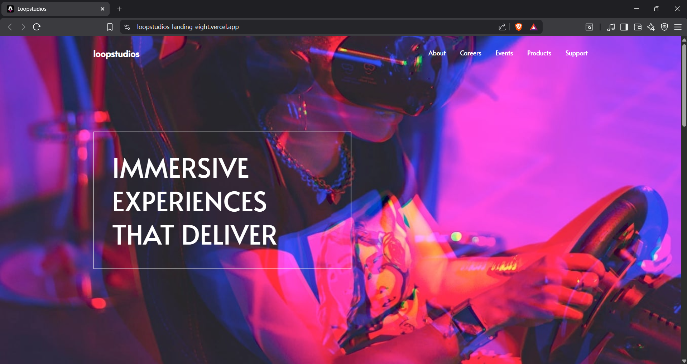

# 🏝️ Proyecto: Loopstudios Landing Page

Este proyecto consiste en el desarrollo de la **landing page de Loopstudios** utilizando **Astro** y **Tailwind CSS**.  
El objetivo es aplicar los conocimientos sobre **componentes de Astro**, **maquetación**, **estilos responsivos** y **utilidades CSS** para construir un diseño limpio, moderno y adaptable a diferentes dispositivos.

---

## 📖 Descripción general

### 🧩 Vista previa del proyecto



---

### 🔗 Enlaces del proyecto

- [**Repositorio en GitHub**](https://github.com/atarisama/loopstudios-landing)
- [**Sitio desplegado (Vercel)**](https://loopstudios-landing-eight.vercel.app/)

---

## 🧠 Proceso de desarrollo

### 🛠️ Tecnologías utilizadas
Lista las herramientas y tecnologías que utilizaste en el proyecto. Por ejemplo:

- [Astro](https://astro.build)
- [Tailwind CSS](https://tailwindcss.com/)
- HTML5 semántico
- Diseño responsivo (Mobile-first)
- Componentes de Astro reutilizables
- Interacciones con JavaScript (opcional para el toggle del menú móvil)

---

### 💡 Lo que aprendí
Con este proyecto pude reforzar el uso de los componentes de astro separando el landing en secciones como lo son header, hero, about, creations y footer, lo que facilita la organización del código.

Otro aprendizaje importante fue el menú hamburguesa, utilizando JavaScript para manejar las interacciones y darle un buen aspecto.

Ejemplo:
```html
<section class="relative">
  
  

  <div class="absolute inset-0 flex items-center">
    <h1 class="text-white text-4xl md:text-6xl uppercase border-2 border-white p-6 max-w-md">
      Immersive experiences that deliver
    </h1>
  </div>
</section>
```
---

### 🚀 Áreas de mejora

- Mejorar el manejo del responsive en pantallas pequeñas.  
- Implementar animaciones o transiciones suaves.  
- Explorar el uso de variables de Tailwind personalizadas.  
- Optimizar la estructura del proyecto y el uso de componentes.  

---

### 📚 Recursos útiles

- [Documentación de Astro](https://docs.astro.build)  
- [Guía oficial de Tailwind CSS](https://tailwindcss.com/docs)  
- [MDN Web Docs - HTML y CSS](https://developer.mozilla.org/es/)  
- [Guía de diseño responsivo](https://web.dev/responsive-web-design-basics/)  

---

### 👩‍💻 Autor

- **Nombre completo: Jesús Elí Sánchez Ruvalcaba**  
- **Carrera: TICs**  
- **Grupo: TC1**  
- **Correo institucional: 23151326@aguascalientes.tecnm.mx** 

---

### ✨ Reflexión final

Durante la realización del proyecto, la parte que mas sencilla se me hizo fue el estructurar los componentes base, esto astro lo facilita mucho al momento de organizar el código.

Una de las cosas mas desafiantes fue lograr que el diseño sea similar al proyecto proporcionado por el docente, ya que a pesar de tener la mayoría de información y assets para hacerlo, dejarlo al 100% igual es muy complejo y difícil.

Uno de los aprendizajes que siento es de los mas importantes fue el hecho de dividir correctamente la interfaz en componentes reutilizables para el menú móvil.

En futuros proyectos me gustaría aplicar todos estos conocimientos para crear alguna pagina un poco mas compleja y dar una experiencia de usuario mas pulida.
